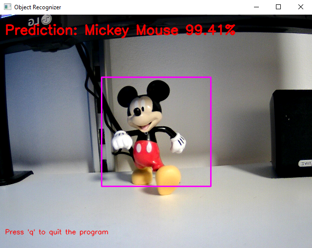

# Object-Recognizer
Python command that allow to train a model and use it to recognize objects.

## How to run ##
The command has two type of invocation:
* Option --train (-t)
  ```
  python objRecognition.py -t <objects_list>
  ```
  Example:
  ```
  python objRecognition.py -t "Mickey Mouse" "Minnie"
  ```
  
* Option --model (-m) 
  ```
  python objRecognition.py -m <model_name>
  ```
  Example:
  ```
  python objRecognition.py -m object_group_1
  ```
  
### Optional arguments ###
```
  -h, --help            show this help message and exit
  -t TRAIN [TRAIN ...], --train TRAIN [TRAIN ...]
                        Train a new model. You must write the list of objects name to detect.
                        E.g: python objRecognition -t dog cat pen
  -n NIMAGES, --nimages NIMAGES
                        Images number for each object to train the model.
                        Default: 100
  -m MODEL, --model MODEL
                        Model file name to use for the recognition.
                        E.g: python objRecognition -m objectGroup1
```
**Note**: _It makes sense to use the -n option only with the -t option_

## Requirements ##
This script requires installed the following Python libraries:
* opencv
* tensorflow
* scikit-learn
* numpy

## Screenshot ##

